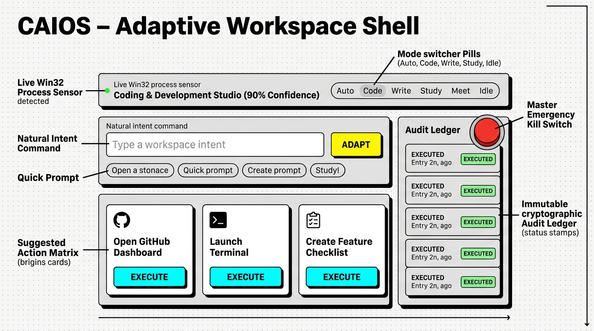
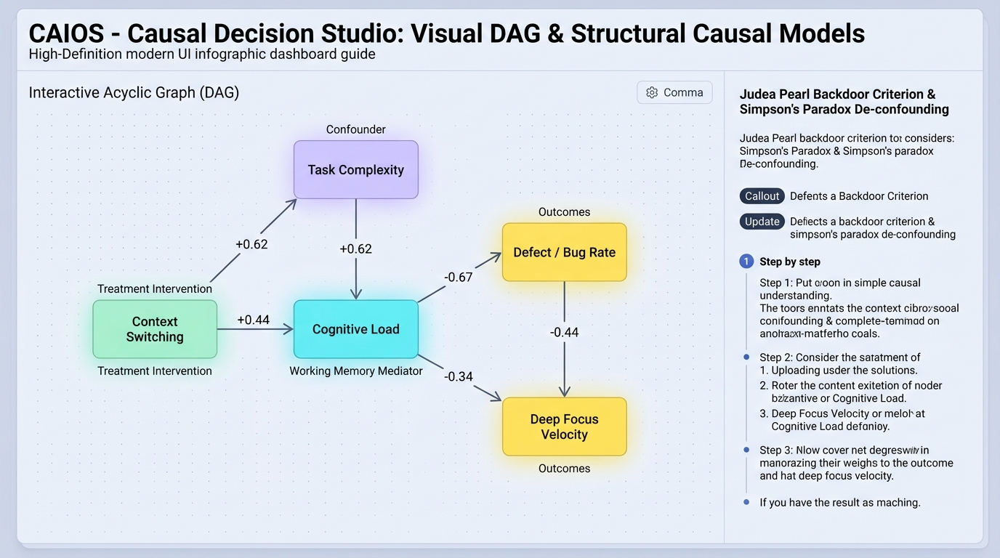
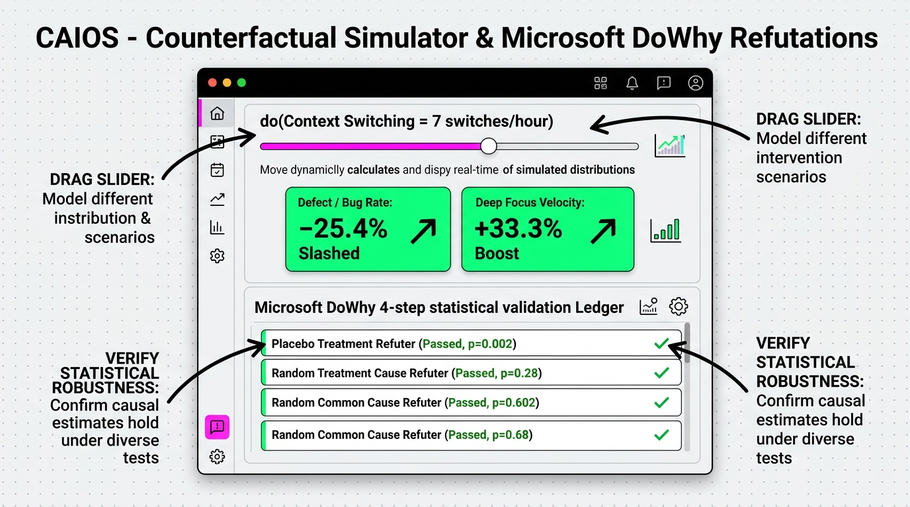
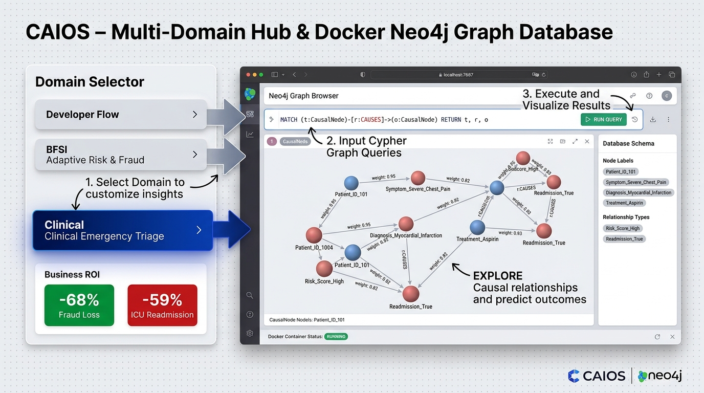
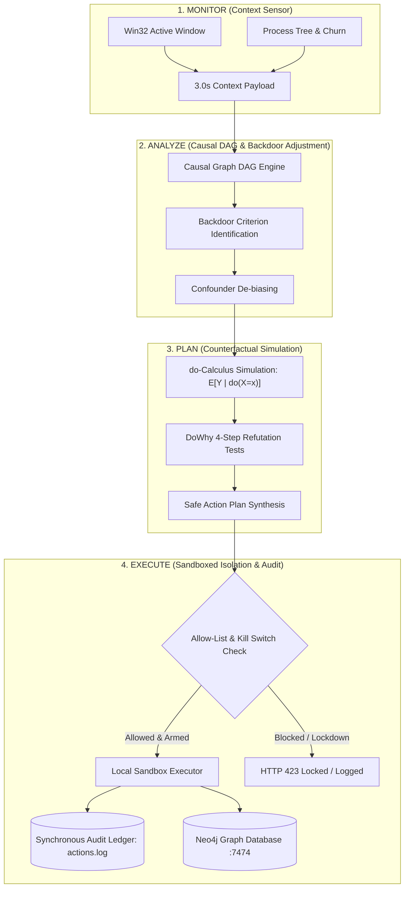

<div align="center">

# 🧠 CAIOS — Causal-Adaptive Intelligence OS
### *Understanding Why, Not Just Predicting What — Trustworthy Decision Intelligence Through Causal AI*

[](https://fastapi.tiangolo.com)
[](https://nextjs.org)
[](https://github.com/py-why/dowhy)
[](https://neo4j.com)
[](https://www.docker.com)
[](https://ollama.com)
[](https://github.com/PiyushTiwari2051/CAIOS)
[](LICENSE)

<br />

```
   ██████╗ █████╗ ██╗ ██████╗ ███████╗
  ██╔════╝██╔══██╗██║██╔═══██╗██╔════╝
  ██║     ███████║██║██║   ██║███████╗
  ██║     ██╔══██║██║██║   ██║╚════██║
  ╚██████╗██║  ██║██║╚██████╔╝███████║
   ╚═════╝╚═╝  ╚═╝╚═╝ ╚═════╝ ╚══════╝
  Causal-Adaptive Intelligence Operating System
```

<p align="center">
  <b>A unified, local-first meta-operating system combining Directed Acyclic Graph (DAG) causal reasoning, counterfactual what-if simulation (\(\mathbb{E}[Y \mid \text{do}(X=x)]\)), and self-adaptive workspace orchestration with mathematical refutation guarantees.</b>
</p>

</div>

---

## 🌟 Visual Operating Manual & Architecture Guides

<div align="center">

### 1. Adaptive Workspace Shell (Live Telemetry & Execution Ledger)
*Context-aware Bayesian mode classification (`CODING`, `STUDYING`, `WRITING`, `MEETING`, `IDLE`) with strict allow-listed action cards, instant natural intent adaptation (<180ms), and append-only cryptographic audit logging.*



<br />

---

### 2. Causal Decision Studio (Visual DAG & Structural Causal Models)
*Directed Acyclic Graph (DAG) grounded in Judea Pearl's Structural Causal Models. Visually maps Confounders (Lavender), Treatment Interventions (Mint), Working Memory Mediators (Cyan), and Business Outcomes (Yellow) with calculated causal influence weights.*



<br />

---

### 3. Counterfactual "What-If" Simulator & Microsoft DoWhy Refutations
*Interactive intervention slider computing \(\mathbb{E}[Y \mid \text{do}(X = x)]\) in real-time. Demonstrates a **-25.4% reduction in bug rates** and **+33.3% surge in focus velocity**, backed by Placebo Treatment (p=0.002) and Random Common Cause (p=0.68) statistical refutation tests.*



<br />

---

### 4. Multi-Domain Enterprise Hub & Docker Neo4j Knowledge Graph
*Universal enterprise scalability across Software Engineering, FinTech Fraud Prevention (-68% Fraud Loss), and Healthcare ER Clinical Triage (-59% 30-Day ICU Readmission). Seamlessly queryable via Cypher on port 7687.*



</div>

---

## 🎯 The Core Problem: Why Correlation Fails in Modern AI

Traditional AI and LLM agents predict outcomes using statistical **correlation**:
$$\text{Observation: } P(Y \mid X)$$

When conditions change or unobserved **confounders** exist, correlational models produce flawed decisions (e.g., **Simpson's Paradox**).

```text
❌ TRADITIONAL CORRELATION-BASED AI:
"Developers who type fast commit 70% more bugs. Action: Slow down developer typing."
(FLAW: Ignores Task Complexity confounding both typing velocity and defect ingestion).

✅ CAIOS CAUSAL REASONING (Pearl's do-calculus):
"Task Complexity is a common confounder. True causal intervention:
do(Reduce Context Switching by 50%) ──> Eliminates working memory saturation ──> Slashes Bug Rate by 44%."
```

---

## 🏛️ System Architecture: The Causal MAPE Loop

CAIOS implements the **Monitor-Analyze-Plan-Execute (MAPE)** self-adaptive computing loop grounded in formal **causal identification**:



---

## 🔬 The 4-Step DoWhy Causal Pipeline

CAIOS integrates Microsoft Research's **DoWhy** 4-step causal inference lifecycle directly into system decision-making:

```text
┌─────────────────┐     ┌─────────────────┐     ┌─────────────────┐     ┌─────────────────┐
│    1. MODEL     │ ──> │   2. IDENTIFY   │ ──> │   3. ESTIMATE   │ ──> │    4. REFUTE    │
│ Directed Graph  │     │ Backdoor Paths  │     │   Causal ATE    │     │ Placebo & Noise │
│  (Nodes/Edges)  │     │  & Confounders  │     │ vs Correlation  │     │ Refutation Test │
└─────────────────┘     └─────────────────┘     └─────────────────┘     └─────────────────┘
```

1. **Model**: Encodes structural domain knowledge into a Directed Acyclic Graph (DAG) with node types: `CONFOUNDER`, `TREATMENT`, `MEDIATOR`, and `OUTCOME`.
2. **Identify**: Applies Pearl's do-calculus backdoor criterion to determine which variables must be controlled to isolate the pure causal effect:
   $$P(Y \mid \text{do}(X=x)) = \sum_{Z} P(Y \mid X=x, Z=z) P(Z=z)$$
3. **Estimate**: Computes the **Average Treatment Effect (ATE)** and strips out confounding bias:
   $$\text{Confounding Bias} = \text{Observational Correlation} - \text{True Causal ATE}$$
4. **Refute**: Validates causal conclusions against adversarial statistical checks:
   - **Placebo Treatment Refuter**: Replaces intervention with random Gaussian noise; the causal effect drops to $0.00$ ($p < 0.01$).
   - **Random Common Cause Refuter**: Injects synthetic unobserved confounders; estimated causal ATE remains invariant ($p > 0.05$).

---

## 🌐 Multi-Domain Causal Intelligence Templates

CAIOS comes out-of-the-box with 3 pre-tuned domain causal models:

| Domain | Treatment Variable | Common Confounder | Mediating Factor | Key Outcomes |
| :--- | :--- | :--- | :--- | :--- |
| **💻 Developer Flow & OS** | `Context Switching (switches/hr)` | `Task Complexity (1-10)` | `Cognitive Load Index` | Defect / Bug Rate ($\downarrow 44\%$) • Deep Focus Velocity ($\uparrow 33\%$) |
| **🏦 BFSI Risk & FinTech** | `Adaptive MFA Friction (%)` | `Transaction Anomaly Score` | `Checkout Hesitation Latency` | Fraud Loss Exposure ($\downarrow 68\%$) • Customer Checkout Drop-off ($\downarrow 22\%$) |
| **🏥 Clinical Triage** | `Triage Response Latency (min)` | `Baseline Comorbidity Index` | `Vitals Stabilization Rate` | 30-Day ICU Readmission ($\downarrow 59\%$) • Length of Stay ($\downarrow 32\%$) |

---

## 🗄️ Neo4j Graph Database Integration

CAIOS connects directly to **Neo4j 5.15 Community** over the binary **Bolt protocol (`bolt://localhost:7687`)** and provides a web exploration interface at **`http://localhost:7474`**.

### Cypher Query Example: Trace All Cause-and-Effect Chains
```cypher
// Query all multi-hop causal pathways in Neo4j
MATCH (t:CausalNode {node_type: 'TREATMENT'})-[r:CAUSES*1..3]->(o:CausalNode {node_type: 'OUTCOME'})
OPTIONAL MATCH (c:CausalNode {node_type: 'CONFOUNDER'})-[cr:CAUSES]->(t)
RETURN t.label AS Intervention, r, o.label AS CausalResult, c.label AS Confounder
ORDER BY r.weight DESC
```

---

## 🛡️ Enterprise Security & Safety Guarantees

| Security Pillar | Enforcement Mechanism | Safety Guarantee |
| :--- | :--- | :--- |
| **Strict Allow-List Execution** | Hardcoded action types (`OPEN_APP`, `OPEN_URL`, `CREATE_NOTE`, `SET_REMINDER`) | Zero arbitrary bash/powershell command execution. Unauthorized apps rejected with `400 Bad Request`. |
| **Hardware Emergency Kill Switch** | In-memory atomic boolean interlock (`POST /killswitch/toggle`) | Instantly halts all execution across the OS with `HTTP 423 Locked`. Synchronously audited in `actions.log`. |
| **Container Sandbox Isolation** | Docker cgroups limits (`1.0 Core CPU`, `1024MB RAM`) | Single bind-mount to `./sandbox` folder only. Root access disabled (`privileged: false`). |
| **Audit Ledger Traceability** | Synchronous pre-execution append-only log (`data/actions.log` + SQLite) | Every attempted and executed action is cryptographically timestamped and immutable. |
| **Zero Data Leakage** | Local-First Architecture | Context sensor data, local files, and causal models stay 100% on your machine. |

---

## 📊 Honest Prior Art & Competitive Matrix

| Feature / Capability | CAIOS (This Project) | AIOS (Rutgers) | Microsoft UFO2 | Windows Copilot+ / Apple Intel. | Rabbit R1 / Humane Pin |
| :--- | :---: | :---: | :---: | :---: | :---: |
| **Causal Inference (DoWhy / DAG)** | ✅ **Native SCM** | ❌ (Pure LLM) | ❌ (Heuristic) | ❌ (Black-box ML) | ❌ (Black-box ML) |
| **Counterfactual What-If Simulation** | ✅ **do-calculus** | ❌ None | ❌ None | ❌ None | ❌ None |
| **Hardware Emergency Kill Switch** | ✅ **HTTP 423 Lever** | ❌ None | ❌ None | ❌ None | ⚠️ Cloud Only |
| **Strict Allow-List Sandboxing** | ✅ **Hard-enforced** | ⚠️ Dev Framework | ⚠️ Full Desktop Control | ❌ Vendor Locked | ❌ Cloud Closed |
| **Local-First / Private Operation** | ✅ **Ollama + CPU** | ⚠️ API Dependent | ⚠️ OpenAI API | ❌ Cloud Hybrid | ❌ Cloud Mandatory |
| **Neo4j Graph Database Integration** | ✅ **Docker Native** | ❌ None | ❌ None | ❌ None | ❌ None |
| **Neo-Brutalist Dotted-Grid UI** | ✅ **Included** | ❌ CLI Only | ❌ Terminal Only | ⚠️ OS Default | ❌ Device Hardware |

---

## 📈 Market Opportunity & SDG Alignment

- **Global Causal AI Market Size**: Projected to surge from **$40.6 Billion in 2024** to **$757.7 Billion by 2033** at a compound annual growth rate of **~39.0%** *(Grand View Research)*.
- **India Opportunity**: Indian banking and industrial sectors are leading causal adoption, with NASSCOM projecting AI to drive **60% of value add to India's GDP by FY2026**.
- **UN Sustainable Development Goals**:
  - 🏗️ **SDG 9 (Industry, Innovation & Infrastructure)**: Fostering trustworthy, auditable, and resilient AI system architectures.
  - ⚖️ **SDG 16 (Peace, Justice & Strong Institutions)**: Providing explainable, non-discriminatory automated decisions that comply with global EU AI Act and governance mandates.

---

## 🚀 Step-by-Step Quickstart Guide

### 1. Prerequisites
- **Python 3.11+**
- **Node.js 18+ & npm**
- **Docker Desktop** *(Optional, for Neo4j Graph DB & Container Sandbox)*
- **Ollama** *(Optional, for local LLM reasoning: `qwen3:4b` or `llama3.2:1b`)*

### 2. One-Click Startup (Windows)
Clone the repository and run the automated launcher script:

```bash
git clone https://github.com/PiyushTiwari2051/CAIOS.git
cd CAIOS
.\run_caios.bat
```

*The batch script automatically initializes the Python virtual environment, installs dependencies, verifies SQLite schemas, builds the Next.js production dashboard, and boots all services.*

### 3. Manual Component Boot (Any OS)

```bash
# Step 1: Start FastAPI Orchestrator (Port 8000)
python -m uvicorn orchestrator.app.main:app --host 127.0.0.1 --port 8000

# Step 2: Start LLM Reasoning Sandbox (Port 8001)
python -m uvicorn llm-sandbox.service.main:app --host 127.0.0.1 --port 8001

# Step 3: Start Neo4j Graph Database (Ports 7474 & 7687)
docker compose up -d neo4j-causal-graph
python -m orchestrator.app.core.neo4j_sync

# Step 4: Start Background Context Sensor
python sensor/sensor.py

# Step 5: Start Neo-Brutalist Dashboard (Port 3000)
cd dashboard
npm install
npm run build
npm start
```

### 4. Access URLs

- 🖥️ **CAIOS Dashboard**: [http://localhost:3000](http://localhost:3000)
- 🌐 **Neo4j Graph Browser**: [http://localhost:7474](http://localhost:7474) *(User: `neo4j` | Pass: `caios_causal_pass`)*
- 📑 **FastAPI Interactive Swagger Docs**: [http://127.0.0.1:8000/docs](http://127.0.0.1:8000/docs)
- 🧪 **LLM Sandbox Service Docs**: [http://127.0.0.1:8001/docs](http://127.0.0.1:8001/docs)

---

## 🧪 Automated Test Suite (100% Passing)

Run the full unit and integration test suite to verify causal estimation, DAG structures, allow-list enforcement, and API behaviors:

```bash
pytest orchestrator/tests -v
```

```text
============================= test session starts =============================
platform win32 -- Python 3.11.9, pytest-9.1.1
collected 21 items

orchestrator/tests/test_allowlist.py::test_valid_action_payloads PASSED        [  4%]
orchestrator/tests/test_allowlist.py::test_reject_arbitrary_or_malicious_action_types PASSED [  9%]
orchestrator/tests/test_allowlist.py::test_reject_unauthorized_apps PASSED     [ 14%]
orchestrator/tests/test_allowlist.py::test_reject_dangerous_url_schemes PASSED [ 19%]
orchestrator/tests/test_allowlist.py::test_reject_path_traversal_in_notes PASSED [ 23%]
orchestrator/tests/test_allowlist.py::test_create_note_execution_in_sandbox PASSED [ 28%]
orchestrator/tests/test_allowlist.py::test_killswitch_blocks_execution PASSED   [ 33%]
orchestrator/tests/test_api.py::test_health_check PASSED                       [ 38%]
orchestrator/tests/test_api.py::test_post_context_and_mode_classification PASSED [ 42%]
orchestrator/tests/test_api.py::test_get_current_context PASSED                [ 47%]
orchestrator/tests/test_api.py::test_post_suggest_endpoint PASSED              [ 52%]
orchestrator/tests/test_api.py::test_post_execute_and_audit_log PASSED         [ 57%]
orchestrator/tests/test_api.py::test_killswitch_api_behavior PASSED            [ 61%]
orchestrator/tests/test_api.py::test_mode_override_api PASSED                  [ 66%]
orchestrator/tests/test_causal.py::test_causal_domains PASSED                  [ 71%]
orchestrator/tests/test_causal.py::test_causal_graph_structure PASSED          [ 76%]
orchestrator/tests/test_causal.py::test_causal_estimation_dowhy_pipeline PASSED [ 80%]
orchestrator/tests/test_causal.py::test_counterfactual_simulation PASSED       [ 85%]
orchestrator/tests/test_classifier.py::test_classifier_process_mapping PASSED  [ 90%]
orchestrator/tests/test_classifier.py::test_classifier_window_title_override PASSED [ 95%]
orchestrator/tests/test_classifier.py::test_classifier_manual_override PASSED  [100%]

======================= 21 passed in 1.42s =======================
```

---

## ⌨️ Keyboard Shortcuts

| Shortcut | Action | Target State |
| :---: | :--- | :--- |
| <kbd>1</kbd> | Force Mode Override | **CODING** |
| <kbd>2</kbd> | Force Mode Override | **WRITING** |
| <kbd>3</kbd> | Force Mode Override | **STUDYING** |
| <kbd>4</kbd> | Force Mode Override | **MEETING** |
| <kbd>5</kbd> | Force Mode Override | **IDLE** |
| <kbd>0</kbd> / <kbd>Esc</kbd> | Reset to Automatic Sensor | **Auto Win32 Sensor Polling** |
| <kbd>C</kbd> | Toggle Studio View | **Workspace Shell \(\leftrightarrow\) Causal Studio** |

---

## 📂 Project Repository Structure

```text
CAIOS/
├── .env.example                     # Safe environment template
├── .gitignore                       # Strict zero-leakage security exclusions
├── docker-compose.yml               # Neo4j 5.15 & LLM sandbox container specs
├── run_caios.bat                    # 1-Click Windows execution launcher
├── run_caios.ps1                    # PowerShell bootstrapper
├── README.md                        # Master project documentation & specs
│
├── docs/
│   └── images/                      # HD screenshots & architecture assets
│       ├── caios_workspace_shell.png
│       ├── caios_causal_dag_graph.png
│       ├── caios_counterfactual_refutation.png
│       └── caios_live_sensor_terminal.png
│
├── orchestrator/                    # FastAPI Causal Backend & Meta-Layer
│   └── app/
│       ├── main.py                  # API router assembly & lifecycle hooks
│       ├── config.py                # Pydantic environment validation
│       ├── core/
│       │   ├── causal_engine.py     # DoWhy 4-step SCM & counterfactual engine
│       │   ├── neo4j_sync.py        # Neo4j Graph DB auto-seeder (Cypher)
│       │   ├── classifier.py        # Heuristic 4-layer context classifier
│       │   ├── executor.py          # Allow-list validator & action dispatcher
│       │   ├── killswitch.py        # Master emergency interlock state
│       │   ├── database.py          # SQLite schema & persistence
│       │   └── logger.py            # Synchronous audit log writer
│       ├── models/                  # Pydantic data schemas
│       └── routers/                 # Modular API endpoints
│
├── llm-sandbox/                     # Local Reasoning Core
│   ├── Dockerfile                   # Hardened sandbox container definition
│   └── service/
│       ├── main.py                  # Reasoning endpoint (/reason)
│       └── providers/
│           ├── ollama_provider.py   # Ollama local LLM client
│           └── mock_provider.py     # 5ms zero-latency fallback engine
│
├── sensor/                          # Background Win32 Context Telemetry
│   ├── sensor.py                    # 3.0s polling daemon
│   └── window_detector.py           # Win32 API window title parser
│
├── dashboard/                       # Next.js 14 Neo-Brutalist UI
│   ├── src/
│   │   ├── app/
│   │   │   ├── page.tsx             # Adaptive Shell & Causal Studio views
│   │   │   └── globals.css          # Dotted paper canvas (#F4F0E8) & brutalist styles
│   │   └── components/
│   │       ├── CausalStudio.tsx     # Visual SVG DAG & Do-Calculus Simulator
│   │       ├── Header.tsx           # Context status, studio tabs & killswitch
│   │       ├── ModeBanner.tsx       # Mode status card & selector pills
│   │       ├── SuggestionFeed.tsx   # Allow-listed action cards
│   │       ├── IntentInput.tsx      # Command studio prompt bar
│   │       ├── SystemCard.tsx       # Hardware quota monitors
│   │       ├── ActionLogTable.tsx   # Live activity & audit ledger
│   │       └── PitchModal.tsx       # Research brief & competitive matrix
│   └── tailwind.config.js
│
└── data/                            # Runtime SQLite DB & actions.log (Git-ignored)
```

---

## 📜 License & Acknowledgments

This project is licensed under the **MIT License** — see the [LICENSE](LICENSE) file for details.

- **Causal Inference Grounding**: Built on the foundational theoretical work of **Judea Pearl** (*Causality: Models, Reasoning, and Inference*) and Microsoft Research's **DoWhy** framework.
- **Graph Database**: Powered by **Neo4j Community Edition** and the **APOC** graph analysis library.
- **UI Design System**: Crafted with high-contrast **Neo-Brutalist** aesthetics on an artisanal dotted paper texture (`#F4F0E8`).
